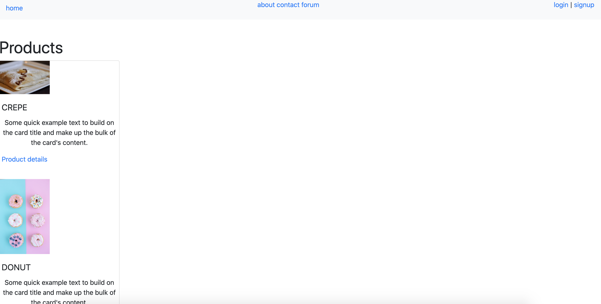
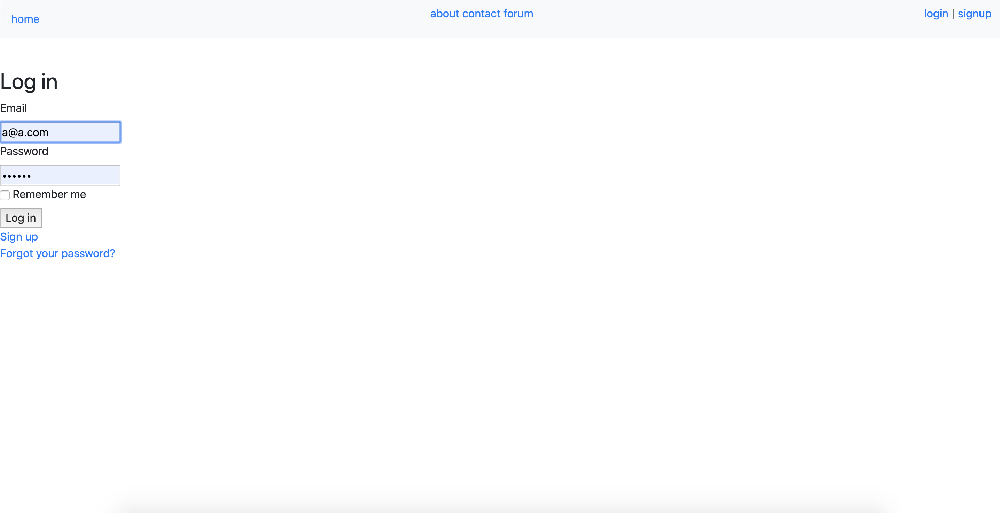
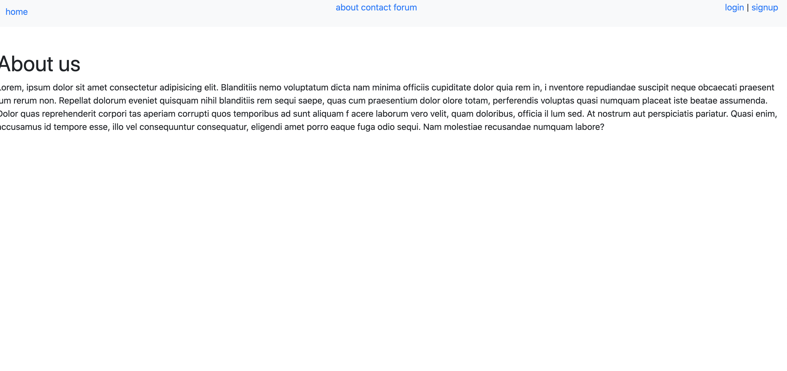
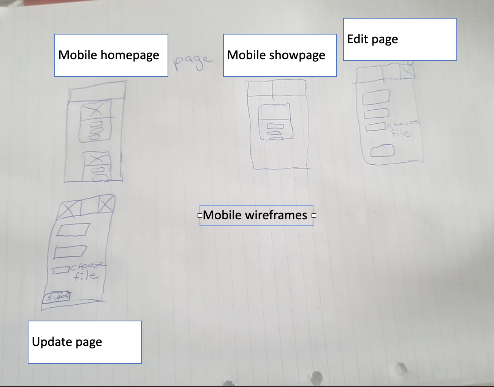
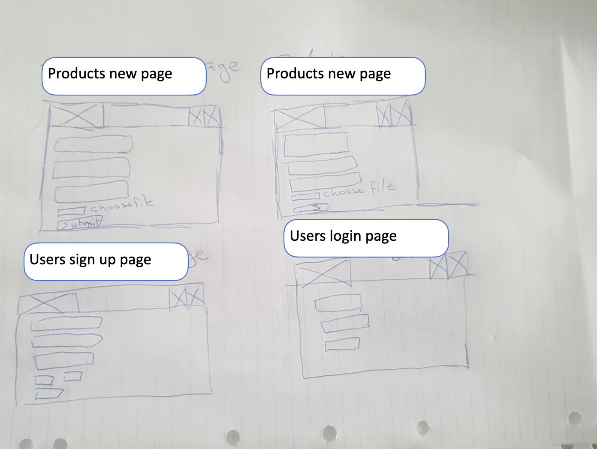
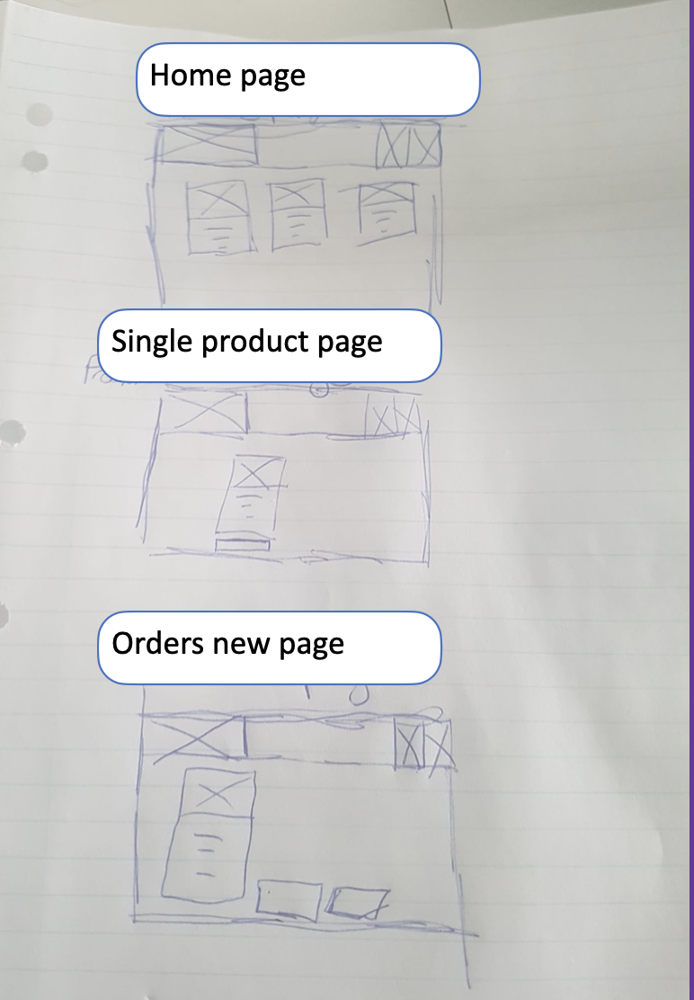
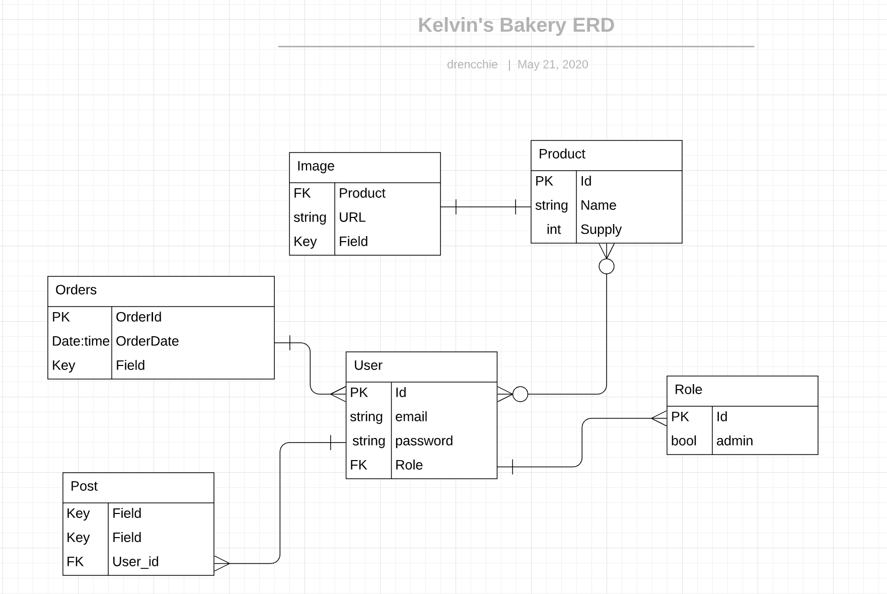
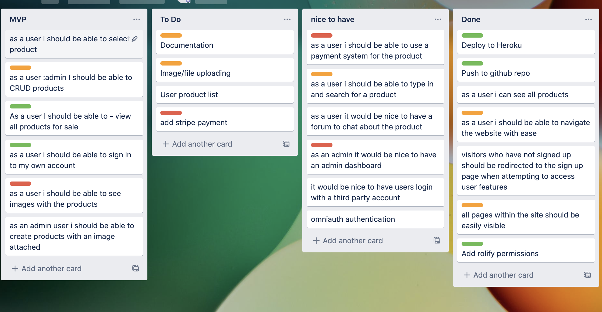

# Kelvin's Bakery

# R7 Identification of the problem you are trying to solve by building this particular marketplace app.
Having a website for your business is essential in today's business environment. Websites give the business owner access to a broader market and allow customer's to find their business online. Many small business owners work long hours and do not possess the skills or knowledge on managing an online presence. Kelvin's bakery is a web application that provides a small business owner with a simple solution for managing the online presence of a bakery business.

# R8 Why is it a problem that needs solving?

As mentioned above having an online presence is an essential part of running a small business. Without a website the business is missing out on access to customers who are searching for a bakery close to them and the ability to sell your products online

# R9 A link (URL) to your deployed app (i.e. website)

[Kelvin's Bakery](https://code-turnip.herokuapp.com/)

# R10 A link to your GitHub repository (repo)

[Github link](https://github.com/BrieferCelery/codeturnip)

# R11 Description of your marketplace app (website), including:

## Purpose: 
To give a small bakery business an online presence, for users to buy products from this small bakery business and the ability to manage their products online.

## Functionality / features: 
- User sign up/ registration
- administrative users are able to perform CRUD operations on the products
- Users can create and order items
- Users can create posts to talk about products

## Site map


## Screenshots





## Target audience
- People aged 18 and over looking for local dining establishments.

## Tech Stack

### Frontend
- HTML5, Ruby on Rails, CSS3

### Backend
- Postgresql

### Hosting
- App is deployed on Heroku (www.heroku.com)

# R12 User stories for your app
- As a user I should be able to register an account
- As a user I should be able to purchase a product
- As a user I should be able to browse the website easily
- As an admin I should be able to create new products
- As an admin I should be able to delete a product
- As an admin I should be able to update a product

# R13 Wireframes for the app





# R14 Entity Relationship Diagram


# R15 Explain the different high-level components (abstractions) in your app
This application was built using the Model-View-Controller(MVC) architecture patten. The app breakdown is as follows -

## Product:
The product model organises the data of a product such as name, price, image and supply. The product model also validates the presence of each data field making sure all fields have a value before storing it. The products controller handles all CRUD operations for product data. Before a page renders the controller ensures data security by allowing access to certain CRUD features if a user is signed in or has special permissions. If they do not have permission they will be redirected to the sign in page. For example an admin user must be the current user in order to use the edit, create and destroy features. The product views present the product data. The views will display actions to the user based on their role for example if a user is not an admin the new product button will not display on the page.

## User:

The user model was created the [Devise](https://github.com/heartcombo/devise) a gem that handles user authentication. The user model handles user data such as email and id. User also connects to the role model to handle special user roles(admin). The user views are automatically generated by Devise and handle user registration, sign in and error handling. The email and password fields have certain conditions that must be met in order to register a user such as minimum password length and the presense of the '@' symbol when entering an email.

## Role: 
The role model was created automatically by the gem [Rolify](https://github.com/RolifyCommunity/rolify). The role model connects to the user model to apply special user priveledges. The model establishes a relationship with the user model through a join table. This section was unchanged for this application 

## Ability:
The ability class defines the abilities that each user has - an admin user has the ability to create, update, destroy data where a regular user can read all data. This file was automatically generated by the gem [cancancan](https://github.com/CanCanCommunity/cancancan)

## Post:
Post model gives the user the ability to write and display a public post about a product on the website. The posts are moderated by an admin user and can only be deleted if a user has an admin role. The posts view pages display each post by descending order of when they were created.

# R16 Detail any third party services that your app will use

The Stripe payment api is used to handle payments for products purchased on the site. Stripe provides a trusted third party to handle payment securely with a valid credit card.

Images on the site are stored in an Amazon simple storage container and allow an admin to upload pictures of the product securely.

Bootstrap is used for styling. 

Gems used - 
``` ruby
gem "devise", "~> 4.7"
# used for user sign up and registration

gem "cancancan", "~> 3.1"

# cacancan is used to give abilities to users and their roles

gem "rolify", "~> 5.2"

# rolify is used create roles and add them to users

gem "bootstrap_form", "~> 4.5"

gem "bootstrap", "~> 4.4"

gem "jquery-rails", "~> 4.4"

# bootstrap and jquery gems used for styling

gem "aws-sdk-s3", "~> 1.64"

# aws sdk is used to connect the application to amazon s3 blob storage

gem "stripe", "~> 5.22"
# stripe gem to implement the stripe payment api
```

# R17 Describe your projects models in terms of the relationships (active record associations) they have with each other

- User has many products and posts
- Post belongs to User and has one attached picture
- Product has one attached picture
- Role has many and belongs to many Users

# R18 Discuss the database relations to be implemented in your application

- Users table has no foreign key
- Products table
- Posts has one foreign key `user_id` to connect a post to a user. Post also has one attached picture
- Active storage table stores the image attached to each product and contains no foreign key
- Roles table contains two foreign keys `user_id` and `role_id`
- Users roles table is a joining table connecting the User and Role models and contains two foreign keys `user_id` and `role_id`.

# R19 Provide your database schema design

```ruby
ActiveRecord::Schema.define(version: 2020_05_20_081014) do

  # These are extensions that must be enabled in order to support this database
  enable_extension "plpgsql"

  create_table "active_storage_attachments", force: :cascade do |t|
    t.string "name", null: false
    t.string "record_type", null: false
    t.bigint "record_id", null: false
    t.bigint "blob_id", null: false
    t.datetime "created_at", null: false
    t.index ["blob_id"], name: "index_active_storage_attachments_on_blob_id"
    t.index ["record_type", "record_id", "name", "blob_id"], name: "index_active_storage_attachments_uniqueness", unique: true
  end

  create_table "active_storage_blobs", force: :cascade do |t|
    t.string "key", null: false
    t.string "filename", null: false
    t.string "content_type"
    t.text "metadata"
    t.bigint "byte_size", null: false
    t.string "checksum", null: false
    t.datetime "created_at", null: false
    t.index ["key"], name: "index_active_storage_blobs_on_key", unique: true
  end

  create_table "posts", force: :cascade do |t|
    t.string "title"
    t.string "content"
    t.bigint "user_id", null: false
    t.datetime "created_at", precision: 6, null: false
    t.datetime "updated_at", precision: 6, null: false
    t.index ["user_id"], name: "index_posts_on_user_id"
  end

  create_table "products", force: :cascade do |t|
    t.string "name", null: false
    t.decimal "price", null: false
    t.integer "supply", null: false
    t.datetime "created_at", precision: 6, null: false
    t.datetime "updated_at", precision: 6, null: false
  end

  create_table "roles", force: :cascade do |t|
    t.string "name"
    t.string "resource_type"
    t.bigint "resource_id"
    t.datetime "created_at", precision: 6, null: false
    t.datetime "updated_at", precision: 6, null: false
    t.index ["name", "resource_type", "resource_id"], name: "index_roles_on_name_and_resource_type_and_resource_id"
    t.index ["resource_type", "resource_id"], name: "index_roles_on_resource_type_and_resource_id"
  end

  create_table "users", force: :cascade do |t|
    t.string "email", default: "", null: false
    t.string "encrypted_password", default: "", null: false
    t.string "reset_password_token"
    t.datetime "reset_password_sent_at"
    t.datetime "remember_created_at"
    t.datetime "created_at", precision: 6, null: false
    t.datetime "updated_at", precision: 6, null: false
    t.index ["email"], name: "index_users_on_email", unique: true
    t.index ["reset_password_token"], name: "index_users_on_reset_password_token", unique: true
  end

  create_table "users_roles", id: false, force: :cascade do |t|
    t.bigint "user_id"
    t.bigint "role_id"
    t.index ["role_id"], name: "index_users_roles_on_role_id"
    t.index ["user_id", "role_id"], name: "index_users_roles_on_user_id_and_role_id"
    t.index ["user_id"], name: "index_users_roles_on_user_id"
  end

  add_foreign_key "active_storage_attachments", "active_storage_blobs", column: "blob_id"
  add_foreign_key "posts", "users"
end
```

# R20 Describe the way tasks are allocated and tracked in your project

All tasks were allocated to the sole developer and tasks were managed using a scrum board created with [Trello](https://www.trello.com). Tasks were colour sorted using mainly green, orange and red. Green indicating the easiest task, orange medium level task and red being the most difficult

Trello board - 

[Trello board link](https://trello.com/b/XZXiXr1U/t2a2)
